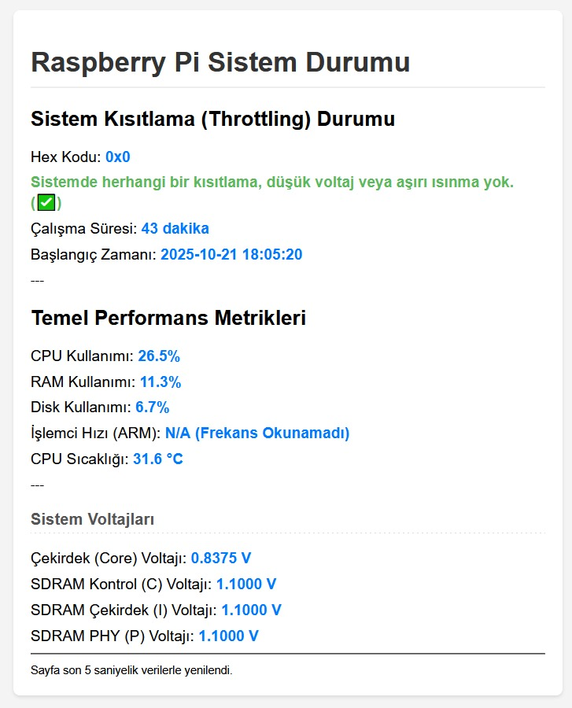

# 🍓 Raspberry Pi Status Monitoring Page

This project is a lightweight Flask-based web application that displays the basic system metrics of your Raspberry Pi device (CPU usage, RAM, disk, temperature, voltage, and throttling status) in real-time. The application is designed to run as a system service behind Nginx and Gunicorn.

# Screenshot

## Features

* **Real-Time Data:** CPU, RAM, and Disk usage percentages.

* **Raspberry Pi-Specific Metrics:**

  * Processor Temperature (`vcgencmd measure_temp`).

  * Core and SDRAM Voltages.

  * **Critical Status Check:** Checks and warns for throttling due to low voltage or overheating (`vcgencmd get_throttled`).

* **Architecture:** Flask + Gunicorn + Nginx (Proxy Pass) + systemd.

* **Easy Installation:** Automatically installs all dependencies and services with a single Bash script (`install.sh`).

## Installation (Raspberry Pi OS)

After downloading the project with Git, you can complete the installation with a single command.

### 1. Downloading the Project

### Create your project directory and enter it

    git clone https://github.com/RecNes/stand-alone-RPi-status-monitoring-page.git
    cd stand-alone-RPi-status-monitoring-page/

### 2. Running the Installation Script

The `install.sh` script will install all system dependencies (Nginx), Python dependencies (`Flask`, `psutil`, `gunicorn`), set up the application as a `systemd` service, and connect it with Nginx.

**Note:** The script will use commands that require root privileges (`sudo`) during execution.

    chmod +x install.sh
    ./install.sh

### What Does the Script Do?

1. **System Check:** Checks if `python3`, `python3-venv`, and `nginx` packages are installed and installs any missing ones.

2. **Virtual Environment:** Creates a virtual environment named `venv` inside your project folder.

3. **Dependencies:** Installs the libraries from the `requirements.txt` file (Flask, psutil, gunicorn) into this environment.

4. **Nginx Configuration:** Copies the `rpi_monitor.nginx` file from the project's root directory to `/etc/nginx/sites-available/` and enables it.

5. **Systemd Service:** Creates the `/etc/systemd/system/rpi_monitor.service` file to start the application with Gunicorn, enables the service, and starts it immediately.

## Usage

After the installation is complete, you can access the application by typing the IP address of your Raspberry Pi into your web browser.

**Example:** `http://[Your Raspberry Pi's IP Address]:5000/`

## Maintenance and Management

Since your application runs as a `systemd` service, management is simple:

| Action | Command | Description |
| :--- | :--- | :--- |
| **Check Status** | `sudo systemctl status rpi_monitor.service` | Shows if the service is running, recent logs, and errors. |
| **Restart** | `sudo systemctl restart rpi_monitor.service` | Restarts the service when you make a change in the code. |
| **Stop** | `sudo systemctl stop rpi_monitor.service` | Stops the service. |
| **Disable Auto-Start** | `sudo systemctl disable rpi_monitor.service` | Prevents the service from starting automatically when the device reboots. |

## Project Files

| File Name | Description |
| :--- | :--- |
| `app.py` | The main Python code for the Flask application. Collects system metrics. |
| `templates/index.html` | The interface template for the application. Displays the data in an organized way. |
| `requirements.txt` | Lists the Python dependencies (`Flask`, `psutil`, `gunicorn`). |
| `install.sh` | The Bash script that automates the entire system setup. |
| `rpi_monitor.nginx` | The proxy configuration for Nginx. Forwards requests to the Gunicorn socket. |
