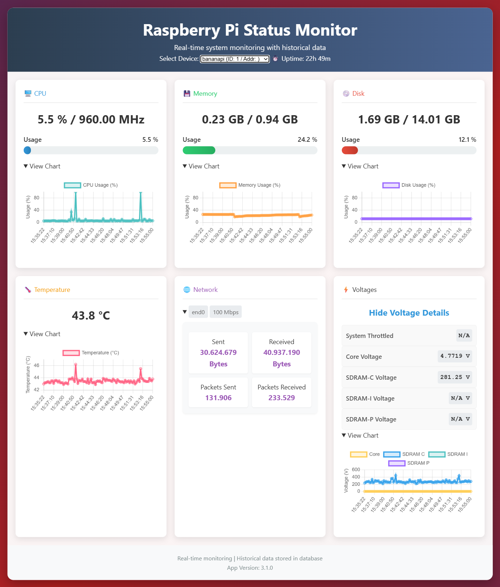

#  Multi-Device Raspberry Pi Status Monitor

# Warning: Due to security considerations, it is recommended for personal/home use only.

Version: 4.0.0

This project provides a centralized web dashboard for monitoring the system metrics of multiple Raspberry Pi (or other Debian-based) devices. It uses a client-server architecture where lightweight clients send data from each monitored device to a central server, which then displays the information in a real-time web interface.

# Screenshot
*(The new interface allows selecting between multiple devices and viewing detailed, collapsible metrics.)*

## Features

*   **Centralized Multi-Device Monitoring:** View the status of all your devices from a single web page.
*   **Real-Time Data:** Live updates for CPU, RAM, Disk usage, Temperature, and Uptime.
*   **Historical Data Charts:** View historical trends for all major metrics in interactive charts.
*   **Click-to-Enlarge Charts:** Click on any chart to view a larger, more detailed version in a modal window.
*   **Detailed Network Statistics:** See in-depth data for each network interface, including traffic and speed.
*   **Voltage & Throttling Status:** Monitor core voltages and system throttling status for Raspberry Pi devices.
*   **Collapsible UI Elements:** Both network cards and metric charts are collapsible for a clean and focused view.
*   **Device Preference:** The dashboard remembers your last selected device across sessions.
*   **Automatic Data Pruning:** The server automatically purges historical data older than 30 days to conserve space.
*   **Inactive Device Removal:** Devices that have been inactive for over a week are automatically removed from the dashboard.
*   **Version Sync:** The client and server versions must match, ensuring data compatibility.
*   **Resilient & Lightweight:** A robust Flask server collects data from multiple Python clients that run efficiently in the background.
*   **Automated Setup:** Simple installation scripts and `systemd` services for both server and client.

## Architecture

The system is split into two main components:

1.  **The Server:** A Flask application that exposes a simple REST API. It has endpoints for clients to register themselves and to submit their metrics. It stores all data in a central SQLite database and serves the web dashboard. The server can run on a Raspberry Pi or any other Debian-based machine.
2.  **The Client:** A lightweight Python script that collects system metrics (CPU, memory, disk, etc.). It registers with the server on its first run and then periodically sends data. It's designed to run on Raspberry Pi, Banana Pi, and other similar SBCs.

## Installation

First, clone the repository on both your server machine and all client machines.

    git clone https://github.com/RecNes/stand-alone-RPi-status-monitoring-page.git

---

### 1. Server Installation

The server can be installed on any Debian-based Linux machine (including a Raspberry Pi).

    # Navigate to the server directory
    cd stand-alone-RPi-status-monitoring-page/server/

    # Make the installation script executable
    chmod +x install_server.sh

    # Run the installation script (requires root privileges)
    sudo ./install_server.sh

This script will:
1.  Create an installation directory at `/opt/rpi-monitor-server`.
2.  Install the required Python dependencies.
3.  Create, enable, and start a `systemd` service named `rpi-monitor-server.service`.

---

### 2. Client Installation

Install the client on each Raspberry Pi or device you want to monitor.

    # Navigate to the client directory
    cd stand-alone-RPi-status-monitoring-page/client/

    # Make the installation script executable
    chmod +x install_client.sh

    # Run the installation script (requires root privileges)
    sudo ./install_client.sh

The script will prompt you to **enter the full URL of the server** (e.g., `http://192.168.1.100:5000`). It will then:
1.  Create an installation directory at `/opt/rpi-monitor-client`.
2.  Configure the client with the server URL you provided.
3.  Install the required Python dependencies.
4.  Create, enable, and start a `systemd` service named `rpi-monitor-client.service`.

## Usage

Once the server and at least one client are running, you can access the web dashboard by navigating to the server's IP address and port in your browser.

**Example:** `http://<your-server-ip>:5000/` (Note: The default server port is now 5000).

The page will load and display a dropdown menu containing all registered devices. Select a device to view its metrics.

*   **View Historical Data:** Click "View Chart" on any metric card to expand a chart showing its recent history.
*   **Network Details:** If a device has multiple network interfaces, they will be displayed in collapsible sections. Click on any interface to see detailed stats.
*   **Voltage Details:** On Raspberry Pi devices, you can view detailed voltage and throttling information in its own card.

## Maintenance and Management

You can manage the server and client applications using `systemctl`.

#### Server Management

| Action          | Command                                           |
| :-------------- | :------------------------------------------------ |
| **Check Status**| `sudo systemctl status rpi-monitor-server.service`|
| **Restart**     | `sudo systemctl restart r-monitor-server.service`|
| **Stop**        | `sudo systemctl stop rpi-monitor-server.service`  |
| **View Logs**   | `sudo journalctl -u rpi-monitor-server.service -f`|

#### Client Management

| Action          | Command                                           |
| :-------------- | :------------------------------------------------ |
| **Check Status**| `sudo systemctl status rpi-monitor-client.service`|
| **Restart**     | `sudo systemctl restart rpi-monitor-client.service`|
| **Stop**        | `sudo systemctl stop rpi-monitor-client.service`  |
| **View Logs**   | `sudo journalctl -u rpi-monitor-client.service -f`|
